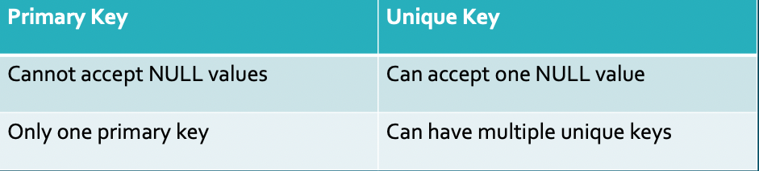
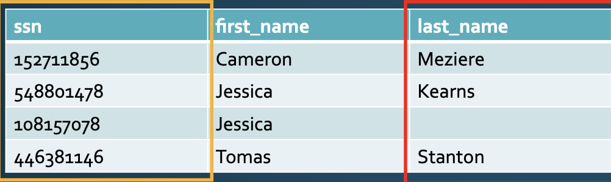
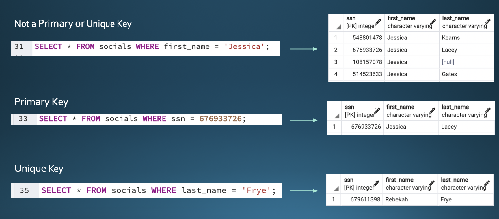
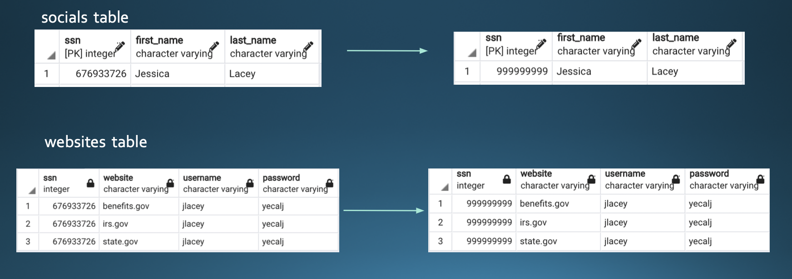

# msds610-dbkeys
Coding Demonstration of Database Keys

## Primary Key & Unique Key
### 1. Difference between Primary Key and Unique Key

In general, one table can set multiple unique keys but only one primary key. Unlike the primary key, unqiue keys torelate null values in a set.

 

### 2. Initialization 

```
CREATE TABLE socials
(ssn INTEGER NOT NULL,
first_name VARCHAR
last_name VARCHAR,
PRIMARY KEY (ssn),
UNIQUE (last_name));
```

 

### 3. Use 
```
SELECT * FROM socials WHERE first_name = 'Jessica';
```
```
SELECT * FROM socials WHERE ssn = 676933726;
```
```
SELECT * FROM socials WHERE last_name = 'Frye';
```
 


### 4. Potential Errors

Violating Primary Key
```
INSERT INTO socials VALUES (676933726,'Jamie','Alberts')

---
ERROR: duplicate key value violates unique constraint "socials_pkey"
DETAIL: Key(ssn)=(676933726) already exists.
SQL state: 23505
```

Violating Unique Key

```
INSERT INTO socials VALUES (111111111,'Edward','Frye')

---
ERROR: duplicate key value violates unique constraint "socials_last_name_key"
DETAIL: Key(last_name) =(Frye) already exists
SQL state:23505
```

## Primary Key & Foreign Key

We use primary key and foreign key to link or relate the information in one table to another table.

### 1. Initialization

```
CREATE TABLE websites
(ssn INTEGER NOT NULL,
website VARCHAR,
username VARCHAR,
password VARCHAR,
FOREIGN KEY(ssn) REFERENCES socials (ssn)
ON DELETE CASCADE ON UPDATE CASCADE);
```

### 2. Use

Join tables

```
SELECT socials.ssn, first_name, last_name, website, username password
FROM socials
JOIN websites ON websites.ssn = socials.ssn
WHERE website='benefits.gov';
```

Update tables automatically

```
UPDATE socials SET ssn = 999999999 where ssn = 676933726
```

 


## AFTER TABLE CREATION

We can also initializa primary key, unique key and foreign key after creating tables; one example below.

```
ALTER TABLE websites ADD PRIMARY KEY (website, username)
```


