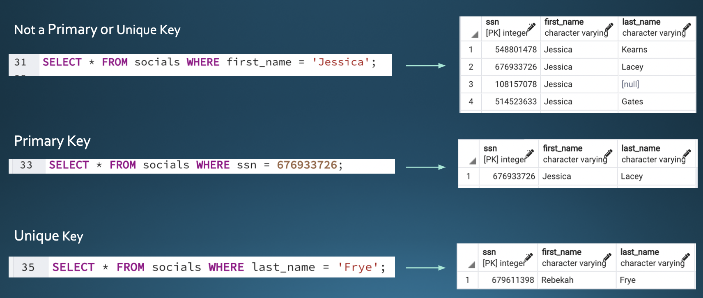

# msds610-dbkeys
Coding Demonstration of Database Keys

## Primary Key & Unique Key
### 1. Difference between Primary Key and Unique Key

In general, one table can set multiple unique keys but only one primary key. Unlike the primary key, unqiue keys torelate null values in a set.

 

### 2. Initialization 

```
CREATE TABLE socials
(ssn INTEGER NOT NULL,
first_name VARCHAR
last_name VARCHAR,
PRIMARY KEY (ssn),
UNIQUE (last_name));

```

 

### 3. Use for Primary Key and Unique Key

 
